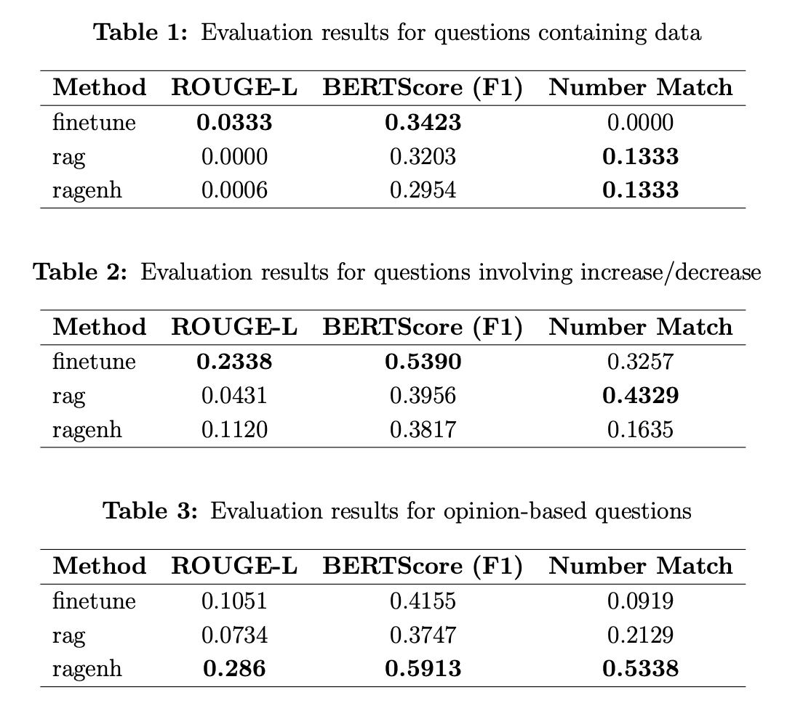
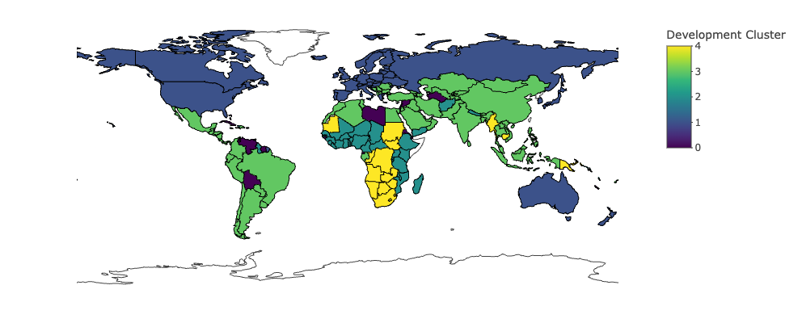
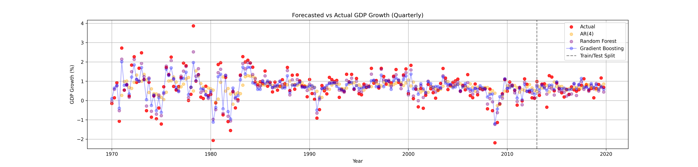
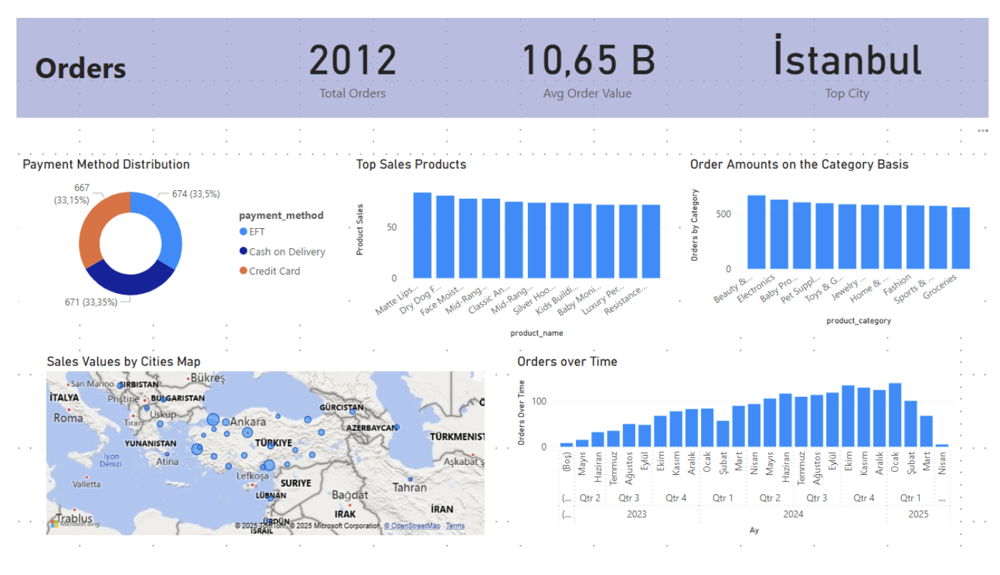

# Senior Economics Student 
I'm a senior economics student at Boğaziçi University, with a strong interest in data analytics, automation, and machine learning applications. I enjoy working with large datasets, uncovering patterns, and building efficient workflows with Python, R, and SQL. I’m currently exploring machine learning applications and improving my skills in finance-related data analysis. Please view my [CV](https://drive.google.com/file/d/1LC0i6enrKl5g6qMN-ivTTudMPnGIyb5W/view?usp=sharing), check out my projects, and feel free to connect with me at [s.nurgkce@gmail.com](mailto:s.nurgkce@gmail.com)! 🚀

  
  &nbsp;&nbsp;
  

## Education
Economics, Boğaziçi University

## Projects

  <!-- Project 1 -->
  

    
    

      <h3>AI-Powered Financial Assistant</h3>
      
Modular LLM & RAG system for corporate QA using fine-tuning and retrieval-based architectures.

      <a href="roboadvisor-project-details.md">View Details</a>
    

  

  <!-- Project 2 -->
  

    
    

      <h3>Development & Sustainability</h3>
      
Clustering and regression analysis on global development and environmental sustainability data.

      <a href="project-details.md">View Details</a>
    

  

  <!-- Project 3 -->
  

    
    

      <h3>US GDP Forecasting</h3>
      
Machine learning models vs time series models for forecasting US GDP growth using tree-based models and PCA.

      <a href="mlproject-details.md">View Details</a>
    

  

  <!-- Project 4 -->
  

    
    

      <h3>Marketing Analytics Dashboard</h3>
      
Simulated e-commerce analytics system with SQL database, MySQL stored procedures and Power BI visualization.

      <a href="sql-project-details.md">View Details</a>
    

  

