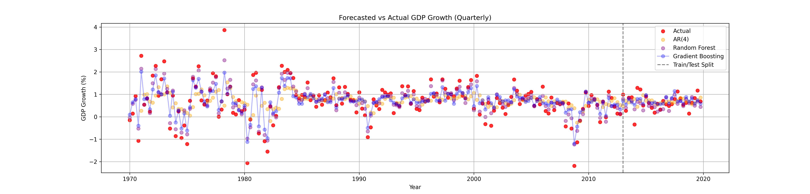

# Senior Economics Student 
I'm a senior economics student at Boğaziçi University, with a strong interest in data analytics, automation, and machine learning applications. I enjoy working with large datasets, uncovering patterns, and building efficient workflows with Python, R, and SQL. I’m currently exploring machine learning applications and improving my skills in finance-related data analysis. Please view my [CV](https://drive.google.com/file/d/1JUE2VNnbzI-5QYHhC7LATKQP0N-28b1q/view?usp=sharing), check out my projects, and feel free to connect with me at [s.nurgkce@gmail.com](mailto:s.nurgkce@gmail.com)! 🚀

/* ### 🌐 Connect with me: */

  
  &nbsp;&nbsp;
  

## Education
Economics, Boğaziçi University

## Projects

### Data Science Final Project
#### Modeling the Relationship Between Development and Environmental Sustainability
This project aims to explore the relationship between the development level of countries and their environmental and sustainability policies. Data from over 200 countries, spanning from **1990 to 2023**, was used, covering various **socio-economic and environmental factors**. The data was cleaned and organized using the **data.table and tidyverse** packages. To analyze the relationship between the selected environmental and socio-economic indicators, **cluster analysis** was performed. **Regression and decision tree models** were then applied **to capture both linear and non-linear relationships**. The results were visualized using the **ggplot2** package to highlight trends at the country level. The project seeks to provide actionable insights into the **key socio-economic factors that affect global sustainable development**.

[View Project Details](project-details.md)

### Machine Learning Final Project
#### Modeling US GDP Growth Using Machine Learning  

In this project, we have analyzed the predictive capabilities of tree-based machine learning models for forecasting the United States’ annual GDP growth, compared to the traditional **Autoregressive Time Series Analysis (AR(4))**. Additionally, we have assessed how our selected features influence GDP growth, analyzing the degree of impact they have in either a **positive or negative direction**.  

Our machine learning framework integrates structural time-series data such as **consumer price index, net savings, and current account balance**, alongside structural indicators like **unemployment rate**. We have employed tree-based ensemble models, specifically **Random Forest and Gradient Boosting**, as well as the unsupervised learning method **Principal Component Analysis (PCA)** to identify the most significant features among the selected indicators.  

The models were trained using data from **1970 Q1 to 2012 Q4** and tested from **2013 Q1 to 2020 Q1**. Model performance comparisons were conducted using **Mean Squared Error (MSE)** as the evaluation metric. The **SHAP (SHapley Additive exPlanations)** values and density plots extracted from tree-based model estimates offer insights into the **directional impact of each feature on GDP growth predictions**.  

Our findings indicate that **Gradient Boosting slightly outperforms Random Forest**, and both models significantly outperform the traditional **Autoregressive Model (AR(4))** in predictive accuracy.  

<!-- İlk iki görsel (Yan Yana) -->

  
  

<!-- Büyük Görsel (Alt Satırda) -->

<!-- Pop-up Açılır Görsel -->

  

[View Project Paper](https://drive.google.com/file/d/1decAKDOtMaB4cRprLFqndsPNoqnHslRR/view?usp=sharing)
