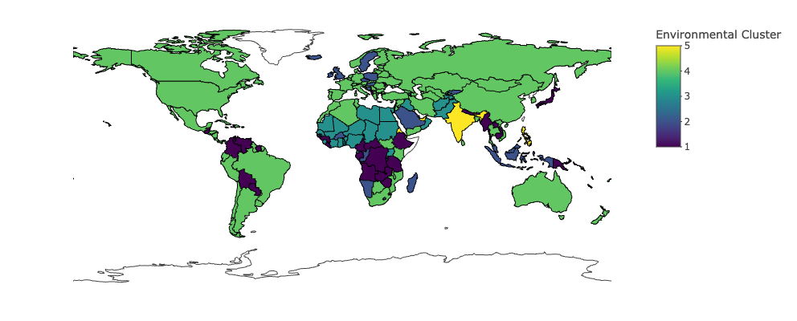

# Saliha Nur Gökçe

I'm a senior economics student at Boğaziçi University, with a strong interest in data analytics, automation, and machine learning applications. I enjoy working with large datasets, uncovering patterns, and building efficient workflows with Python, R, and SQL. I’m currently exploring machine learning applications and improving my skills in finance-related data analysis. 

[CV (Google Drive)](https://drive.google.com/file/d/1LC0i6enrKl5g6qMN-ivTTudMPnGIyb5W/view?usp=sharing)

[LinkedIn](https://www.linkedin.com/in/saliha-nur-gokce/) • [GitHub](https://github.com/saliha-nur-gokce/)

---

## 📊 Projects

---

### AI-Powered Financial Assistant

**Modular LLM & RAG system for corporate QA using fine-tuning and retrieval-based architectures.**

  

[View Details](roboadvisor-project-details.md)

---

### Development & Sustainability

**Clustering and regression analysis on global development and environmental sustainability data.**

  
  

[View Details](project-details.md)

---

### US GDP Forecasting

**Machine learning models vs time series models for forecasting US GDP growth using tree-based models and PCA.**

  
  
  

[View Details](mlproject-details.md)

---

### Marketing Analytics Dashboard

**Simulated e-commerce analytics system with SQL database, MySQL stored procedures and Power BI visualization.**

  

[View Details](sql-project-details.md)
