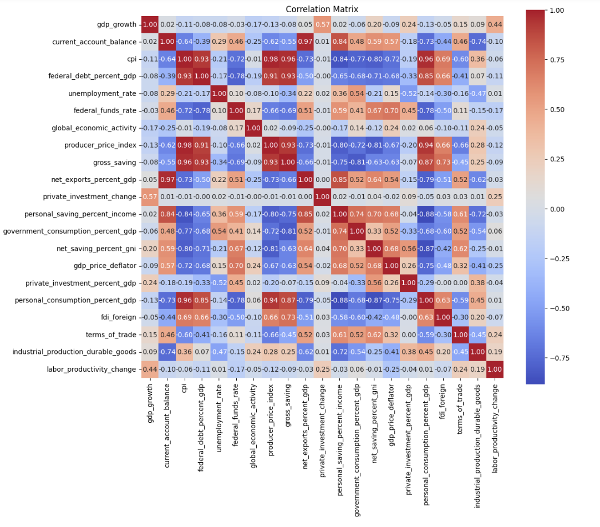

## Machine Learning Final Project Details

This project analyzes the predictive power of **machine learning models** for forecasting **quarterly U.S. GDP growth**, comparing them with the traditional **Autoregressive (AR(4)) model**. Additionally, it examines the impact of key economic indicators on GDP growth, assessing their positive or negative influence. The dataset includes macroeconomic variables from the **Federal Reserve Economic Data (FRED)**, covering the period from **1970Q1 to 2020Q1**.

## **Data and Feature Selection**

The dataset consists of **21 economic indicators**, including inflation, private investment, unemployment rate, and current account balance. To improve predictive accuracy, we conducted **feature selection** using **Random Forest (RF)** and **Gradient Boosting (GB)**, ranking the most influential features based on their impact on GDP growth. **Principal Component Analysis (PCA)** was also applied to reduce dimensionality while preserving essential information.

To examine the relationships between these features, we computed the **correlation matrix**, which highlights the dependencies among macroeconomic variables. This helped us identify **redundant features** and refine our selection for model training.

To further refine feature selection, we used **Random Forest** and **Gradient Boosting** feature importance rankings. These models identified the most influential predictors based on how much each variable reduces prediction error.

- **Random Forest Feature Importance:**
  

- **Gradient Boosting Feature Importance:**

These visualizations highlight the variables that contribute most to GDP growth forecasting, forming the basis for our predictive models.

## **Machine Learning Models and Benchmarking**

The analysis compares **three models**:

- **AR(4) Model:** Uses the last four GDP growth values to make predictions, serving as a baseline.
- **Random Forest (RF):** An ensemble learning method that reduces overfitting by averaging multiple decision trees.
- **Gradient Boosting (GB):** A sequential model that improves accuracy by focusing on previous prediction errors.

The models were trained on data from **1970Q1 to 2012Q4** and tested on **2013Q1 to 2020Q1**. **Mean Squared Error (MSE)** was used as the primary evaluation metric.

## **Model Performance and Key Findings**

The results show that **machine learning models outperform AR(4)** in GDP growth forecasting:

- **Gradient Boosting achieved the lowest test MSE (0.113), followed by Random Forest (0.120), while AR(4) performed the worst (0.157).**
- **RF and GB models were more effective in capturing sudden economic changes**, whereas AR(4) failed to adapt to fluctuations.
- **Feature importance analysis** highlighted **private investment change, labor productivity, and inflation** as the most critical predictors of GDP growth.

## **Model Interpretation and SHAP Analysis**

To understand the impact of features on GDP growth, we used **SHAP (SHapley Additive exPlanations) values**. The analysis revealed that:

- **Private investment change** has the strongest **positive** effect on GDP growth.
- **Labor productivity change** is another key driver of economic expansion.
- **Unemployment rate and public debt** have **negative** contributions to GDP growth.
- **Gradient Boosting provided the most stable and interpretable feature importance rankings.**

## **Forecasting and Visualizations**

The forecast comparison shows that:

- **AR(4) struggles with capturing GDP volatility**, often smoothing out fluctuations.
- **RF and GB track GDP movements more closely, especially during economic shocks.**
- **Density plots highlight how key features behave during periods of high and low GDP growth.**

## **Limitations and Future Work**

- The models capture general GDP trends but **do not provide highly precise forecasts**.
- Incorporating **alternative data sources (e.g., business surveys, sentiment analysis)** could improve accuracy.
- **Deep learning techniques (such as neural networks)** may offer further improvements.
- **Time-series cross-validation methods** could enhance model reliability.

## **Conclusion**

This project demonstrates that **machine learning models significantly outperform traditional econometric methods** in GDP forecasting. The use of **feature selection, SHAP analysis, and density plots** provides deeper insights into economic drivers, making machine learning a valuable tool for macroeconomic analysis.

[View Project Paper for More Detail](https://drive.google.com/file/d/1decAKDOtMaB4cRprLFqndsPNoqnHslRR/view?usp=sharing)
