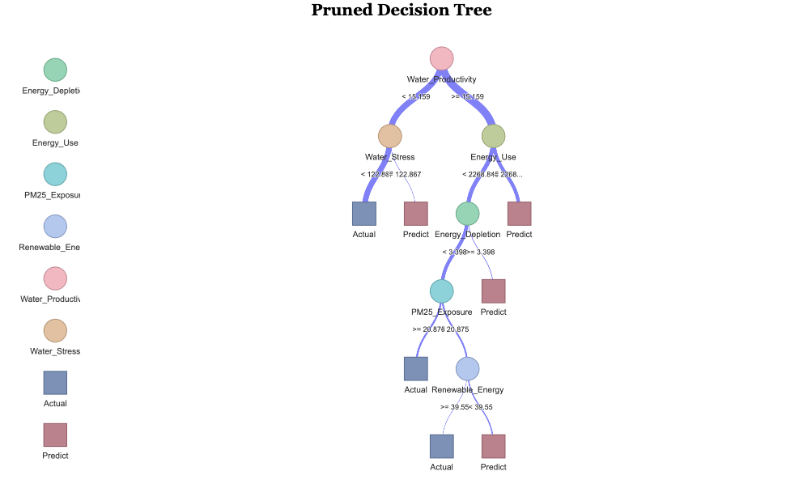
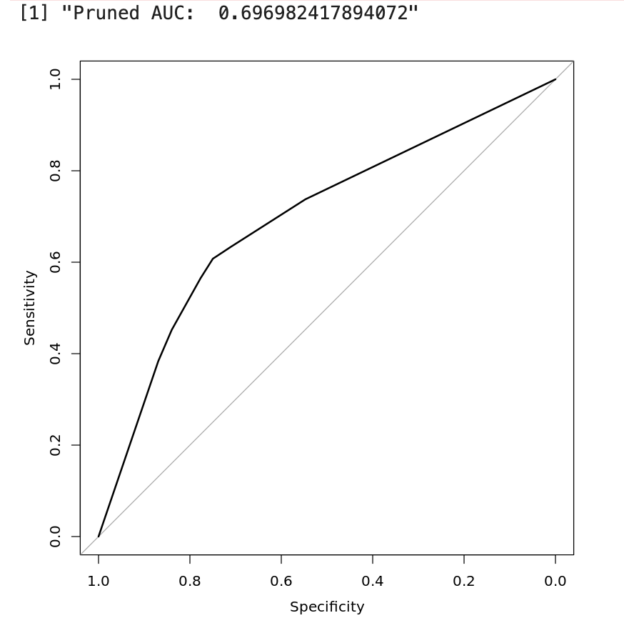

# Data Science Final Project Details

This project explores the relationship between countries' levels of development and their environmental sustainability policies using a dataset spanning from 1990 to 2023, sourced from the World Bank. The dataset includes socio-economic and environmental indicators for over 200 countries. The analysis includes clustering, regression models, and decision tree algorithms to uncover both linear and non-linear relationships among these factors.

## Data Preprocessing and Clustering

The dataset underwent extensive cleaning and organization, where missing values were imputed using different methods such as forward-backward filling and the MICE technique. After preprocessing, cluster analysis was applied using both hierarchical clustering and k-means, with the optimal number of clusters determined via the elbow method. Four clusters were identified, representing developed, less developed, developing, and upper-middle-income countries.

## Cluster Analysis Visualization

It is believed that the initial clustering model may not have produced accurate results because the number of clusters was fixed at (k = 3), which did not fully align with the outcome of the elbow method. To address this, the elbow method was adjusted to identify the optimal cluster size (k = 4), ensuring that the natural structure of the data was better reflected in the clustering process. Additionally, the initial cluster model included too many variables, potentially leading to redundancy and imbalance. To mitigate this, the number of variables was reduced by focusing on key economic indicators. These adjustments aimed to prevent over- or under-clustering, resulting in more balanced and meaningful groupings.

### Cluster Analysis Process

In this cluster analysis, separate clusters were created for environmental and development indicators to demonstrate the relationship between the two contexts. The appropriate number of clusters was determined using the elbow method, and the relationship between the clusters was observed using the correlation matrix. The correlation matrix revealed that:

- Highly developed countries (Dev_Cluster 1) are concentrated in environmentally moderate or industrialized clusters.
- Developing countries (Dev_Cluster 2 and 3) show varying levels of environmental performance.
- Lower development clusters (Dev_Cluster 3) are associated with higher environmental stress.

The correlation analysis highlighted weak relationships between GDP per capita and fossil fuel use (0.15) or renewable energy (-0.33), pointing to diverse energy strategies. Moderate overlaps in CO2 and CH4 emissions (0.28) reflected the impacts of industrial and agricultural activities.

### Key Observations from Cluster Analysis

This cluster analysis uncovered distinct patterns between environmental sustainability and socio-economic development across the clusters:

- **Developed countries (Cluster 1)** show the highest renewable energy use (61.28%), GDP per capita, and life expectancy (78.02), but are still significantly dependent on fossil fuels (47.35%) and face moderate emissions.
- **Less developed countries (Cluster 5)** exhibit low renewable energy use (16.68%), high fossil fuel dependence (76.41%), severe water stress (587.34), and limited GDP per capita ($1,854.16).
- **Transition clusters (3 and 4)** show mixed characteristics, with moderate renewable energy use but fossil fuel dependence and varying environmental pressures.

These findings suggest that developed countries are not in an ideal position regarding their sustainability policies. It can be argued that special policies are needed to enhance sustainability and address inequalities between different development stages.

### Environmental Cluster Ranking

When the clusters are mapped on the world map, the environmental clusters provide more consistent results. Based on the cluster summary, the environmental clusters can be ranked from best to worst as follows:

- **Cluster 1** is the most sustainable, with the highest renewable energy use (61.28%), the lowest fossil fuel dependency (47.35%), minimal water stress, and the largest forest area.
- **Cluster 4 and Cluster 2** follow with moderate renewable energy use and relatively balanced environmental indicators.
- **Cluster 3** faces higher emissions and moderate water stress despite having moderate renewable energy use.
- **Cluster 5** ranks the worst, reflecting severe challenges with the lowest renewable energy use (16.68%), the highest fossil fuel dependency (76.41%), extreme water stress, and minimal forest area.

### Unexpected Findings

It was surprising to find several African and Asian countries in the best environmental cluster, which may be due to data gaps and the methods used to handle missing data. A more expected result is that most of the countries defined as developed were observed in clusters 2 and 4.

## Regression and Decision Tree Models

The analysis was enhanced using multiple regression models to study the linear relationships between socio-economic and environmental indicators. Additionally, decision tree models were built to capture complex, non-linear interactions. The decision tree models were pruned to prevent overfitting, and the resulting tree structures were visualized to interpret key decision paths effectively.

## AUC for Pruned Decision Tree

The pruned decision tree models were evaluated using the AUC (Area Under the Curve) metric to measure their predictive performance. The AUC scores indicate how well the decision tree distinguishes between different levels of sustainability based on socio-economic factors.

## Conclusion

The main objective of this project was to analyze the relationship between countries’ development levels and environmental sustainability policies using a comprehensive dataset covering more than 200 countries spanning over 30 years. The study used clustering, regression and decision tree techniques to reveal patterns, quantify relationships and examine the main socio-economic drivers of sustainability. While some insights were obtained, the analysis faced certain difficulties and limitations.

The regression analysis did not yield a very poor R^2 result when development was reduced to a single value, but when a complex development variable was created by taking the geometric mean, it yielded very low R² values. The low explanatory power of the analysis indicated that the linear relationships between the selected socio-economic and environmental indicators were weaker than expected. Similarly, the cluster analysis provided valuable groupings of countries according to their development and environmental characteristics, but when visualized on global maps, no direct overlap was observed between development and environmental clusters. This discrepancy highlights the complexity of the relationship and may indicate that development and environmental performance are affected by additional, unobserved factors or that our methods of dealing with the NA values ​​at the beginning of the analysis produced a worse result than expected.

Despite these limitations, the analysis achieved some success by identifying separate clusters and revealing nonlinear relationships through decision tree modeling. These approaches revealed important trends, such as the association of lower development clusters with higher environmental stress and the mixed performance of transition economies.

Although the project did not fully achieve its goal of robustly explaining the relationship between development and environmental sustainability, it did provide valuable insights and highlight the significant resulting challenges in analyzing these dynamics. The findings highlight the need for more comprehensive data, refined models, and additional contextual factors to better understand and address the complex interactions between socioeconomic development and environmental sustainability.

